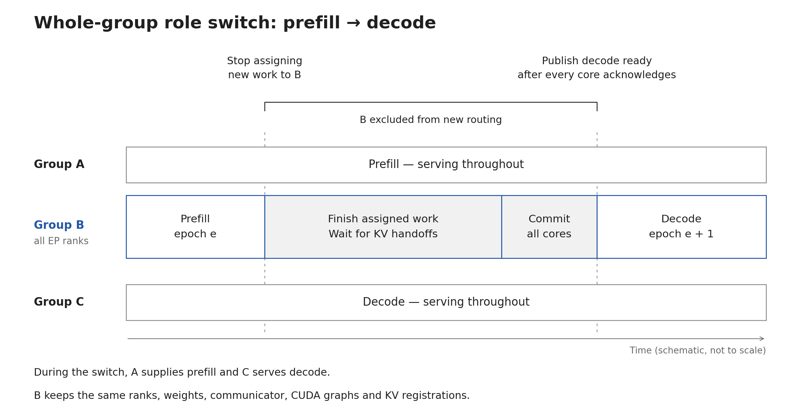
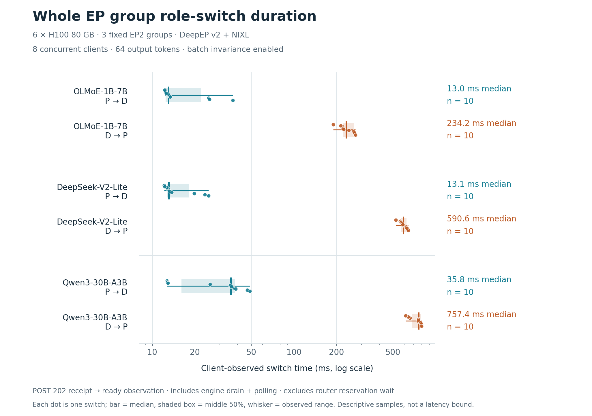

# [RFC]: Runtime prefill/decode role switching for EP groups

## Motivation

With separate prefill and decode pools, a change in the request mix can leave one pool overloaded while the other has spare capacity. We'd like to move a running EP group between those pools without restarting its workers, reloading the model, rebuilding communicators, or recapturing CUDA graphs.

For example, a deployment with two prefill groups and one decode group could move to one prefill group and two decode groups. Each group keeps its membership and expert placement. An EP16 group would change roles as a unit.

The first step would let the group finish its existing work before switching. Other groups keep serving during that interval. This requires spare capacity in both pools; the group being switched temporarily stops accepting new requests.



*Figure 1. B pauses new routing while its entire EP group drains and commits the new role. A and C keep serving during that interval. The timeline is schematic; measured durations appear below.*

## Proposed change

Add an opt-in serving role to the engine, separate from its KV-transfer capabilities. In the prototype, NIXL starts with both producer and consumer capabilities enabled:

```json
{
  "kv_connector": "NixlConnector",
  "kv_role": "kv_both",
  "pd_role": "prefill"
}
```

`pd_role` sets the initial role. The running engine tracks that role and an epoch that advances after each successful switch. Both roles use the same DeepEPv2 backend and startup CUDA graph configuration, with memory sized for either role.

The proposed management API is:

```http
GET /v1/pd_role

POST /v1/pd_role
Content-Type: application/json

{"role": "decode", "expected_epoch": 0, "drain_timeout": 120}
```

The POST returns HTTP 202. The router waits for the new role and epoch to be ready before using the group. The operation survives caller disconnects.

A transition would work as follows:

1. The router stops assigning new work to the group and delivers already assigned handoffs. This includes decode requests still waiting for their prefill response.
2. The frontend closes admission and waits for accepted requests, including preprocessing and streaming responses, to finish.
3. Every engine core prepares the change. Scheduling continues until queued work, pending batches, and retained KV ownership have drained.
4. The coordinator commits the new role on every core and publishes readiness only after all cores acknowledge the same role and epoch.

A prefill response finishing does not mean its KV can be released: a decode worker may still need it. Waiting for that ownership to clear is part of the transition.

The router tags inference requests with `X-vLLM-PD-Role` and `X-vLLM-PD-Epoch`. Stale requests and new arrivals during a transition receive HTTP 409 before inference and can be routed elsewhere. Executed requests are not retried.

If draining times out before commit, the group remains closed in `rolling_back` while the coordinator cancels preparation on every core. It restores the old role once all cores acknowledge cancellation. Failed cancellation or an uncertain commit leaves the group closed in `failed` and requires operator recovery.

## Initial scope

The initial implementation is limited to NIXL pull transfer, one Python HTTP frontend, internal DP load balancing, and text generation with PP=PCP=DCP=1. Speculative decoding, sleep mode, bidirectional KV reuse, and concurrent elastic EP resizing are excluded.

Individual-rank reassignment, live sequence migration, and switching between separately optimized HT/LL paths would be follow-up work. The router owns the capacity policy; vLLM coordinates the role change.

## Prototype results

The comparison used **6 NVIDIA H100 80GB GPUs** as three EP2 groups with TP1/DP2, BF16 weights, DeepEPv2, NIXL, and CUDA graphs enabled. One group stayed prefill, one stayed decode, and the third alternated roles. Each model ran separately on the same GPUs.

Each run used eight concurrent clients, eight fixed prompts of roughly 300 tokens, and 64-token streaming completions with a fresh cache salt. The context limit was 4,096 tokens, and `VLLM_BATCH_INVARIANT=1` was enabled for all three models. Each model first passed a concurrent static baseline, then completed ten switches in each direction.

| Model | Load requests during switching | P→D median | D→P median |
| --- | ---: | ---: | ---: |
| OLMoE-1B-7B-0924-Instruct | 1,679 | 13.0 ms | 234.2 ms |
| DeepSeek-V2-Lite-Chat | 751 | 13.1 ms | 590.6 ms |
| Qwen3-30B-A3B | 630 | 35.8 ms | 757.4 ms |



*Figure 2. Measured switch times for three models, with ten observations in each direction.*

Timing starts when the client receives HTTP 202 and ends when it observes the new role as ready. It includes engine draining and readiness polling, which sleeps 10 ms between checks. Router reservation draining and the POST round trip happen before this interval. Decode-to-prefill also waits for active generations to finish, so these are workload measurements, not latency guarantees.

Across **60 transitions and 3,060 load requests**, there were no request or test-worker errors and no output differences from each model's serial P/D references. Real NIXL transfers into the repurposed group were verified. All six workers kept their process, model allocation, KV allocation, communicator, and NIXL registration identities. CUDA graph identities and capture counts stayed unchanged. The fixed groups continued serving throughout the transitions.

All three models also passed a held-KV test that forced a 250 ms drain timeout, restored the old role without advancing its epoch, and then consumed the same KV successfully. Stale-epoch rejection passed. The final runs had no failed transfers, failed notifications, or expired KV leases, and all cores drained at the end.

The [validation record](VALIDATION.md) contains source revisions, model pins, commands, measured observations, and control-plane regression results.

These are prototype results. The tested build includes a separate, unmerged fix for a pre-existing Triton MoE issue; it is outside the role-switch change. The tests cover EP2 on one node. EP16, multi-node operation, and hardware failure recovery still need validation.

## Related work

SGLang's [DeepEP auto mode](https://github.com/sgl-project/sglang/blob/main/python/sglang/srt/layers/moe/utils.py) chooses a communication mode per batch. Its [P/D role-switching proposal](https://github.com/sgl-project/sglang/pull/28403) also drains before changing roles; the documented validation covers pure TP, with MoE all-to-all handling left for follow-up. The focus here is a complete EP group whose communication resources and graphs remain resident across the change.

This also relates to [#43807](https://github.com/vllm-project/vllm/issues/43807), which discusses deprecating NIXL `kv_both` and asks for runtime-repurposing use cases. The capability and serving-role API should be settled alongside that discussion.

## Feedback

Is draining a complete group a useful first scope? We'd also like feedback on the capability/role API and how to recover when a commit cannot be confirmed on every core.
